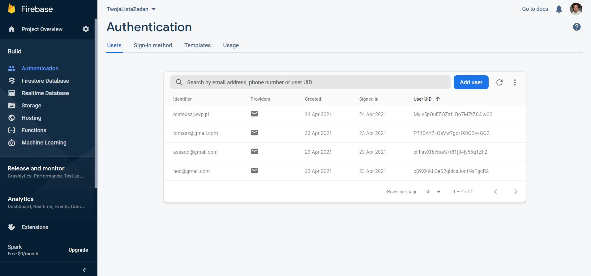
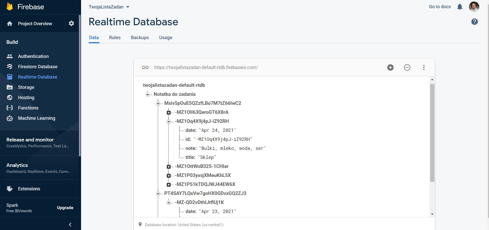
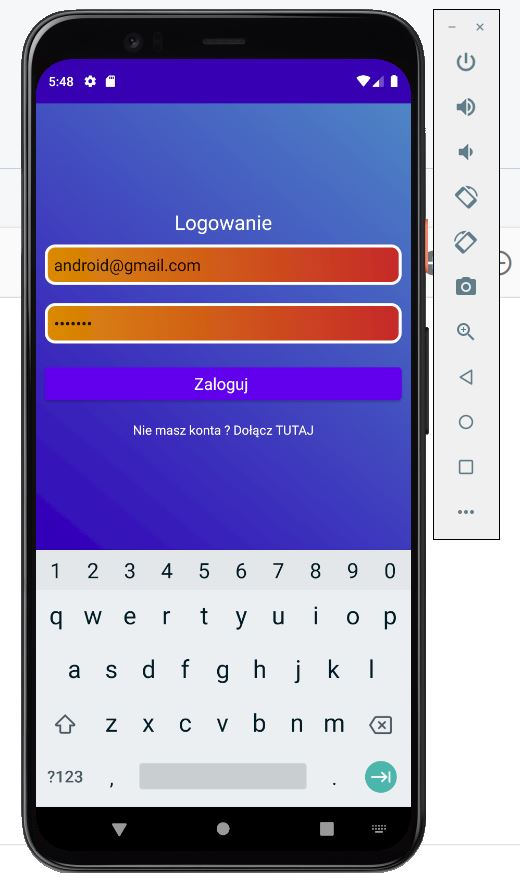
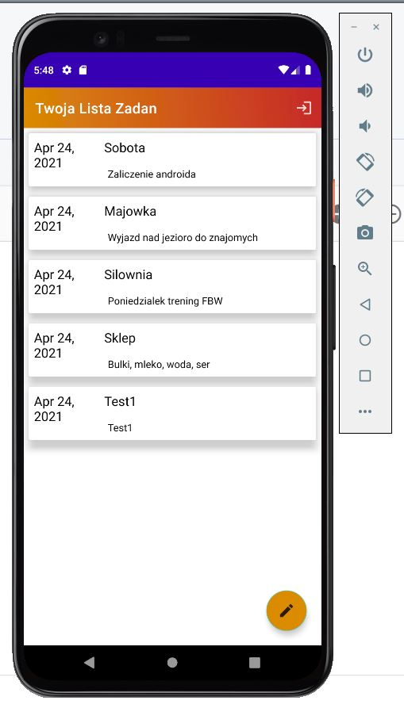
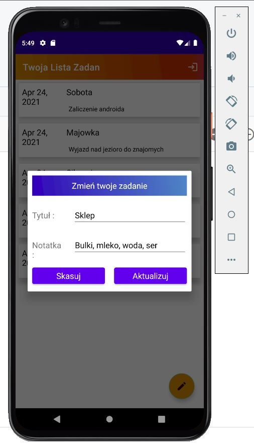

# Twoja Lista Zadań
> Twój osobisty dziennik do wpisywania celow na każdy dzień !

## Spis treści
* [General info](#general-info)
* [Screenshots](#screenshots)
* [Technologies](#technologies)
* [Setup](#setup)
* [Status](#status)
* [Inspiration](#inspiration)
* [Contact](#contact)

## General info
Projekt wykonany na zaliczenie przedmiotu w ramach zajęć z Androida. Możliwość zakładania konta i logowania się za pomocą niego dzięki Firebase Authentication. Każda konto ma osobny dziennik z możliwością dodawania notatek, zmieniania ich treści oraz kasowania dzięki użyciu Firebase Database.

## Screenshots

)

## Technologies
* Android Studio
* Firebase Authentication
* Firebase Realtime Database
* JAVA

## Setup
Wymagana wersja do uruchomienia aplikacji to Android 9.0 PIE

## Code Examples
Przykłady użycia :
`<TextView/>`
`<EditText/>`
`<Button/>`
`<ScrollView/>`
`<LinearLayout/>`
`<RelativeLayout/>`
`private FirebaseAuth mDatabase`
`private DatabaseReference mAuth`

## Status
Project is: _finished_

## Inspiration
Project inspired by [Google Keep](https://keep.google.com/)

## Contact
Created by **Tomasz Kaszuba** oraz **Mateusz Czepirski**
